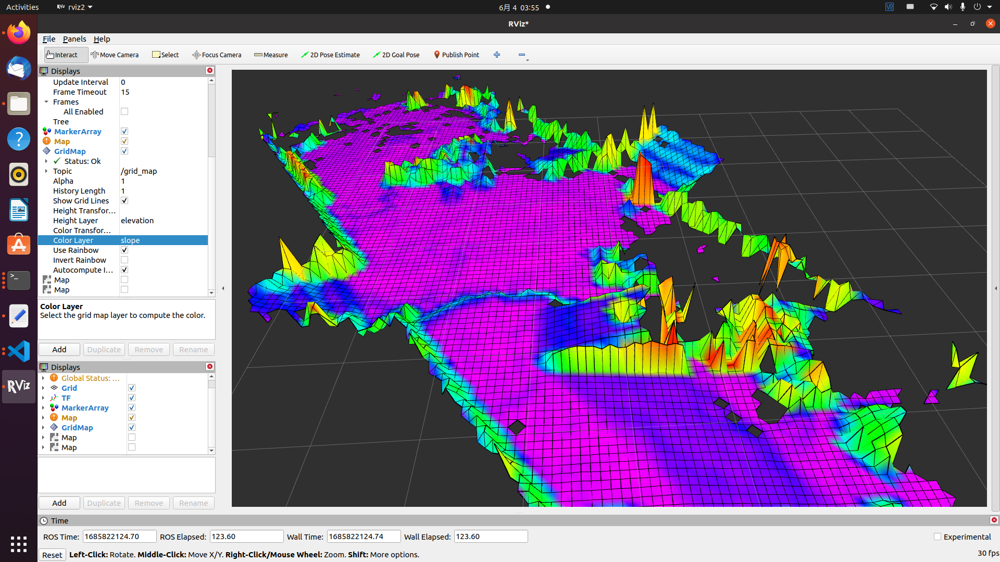
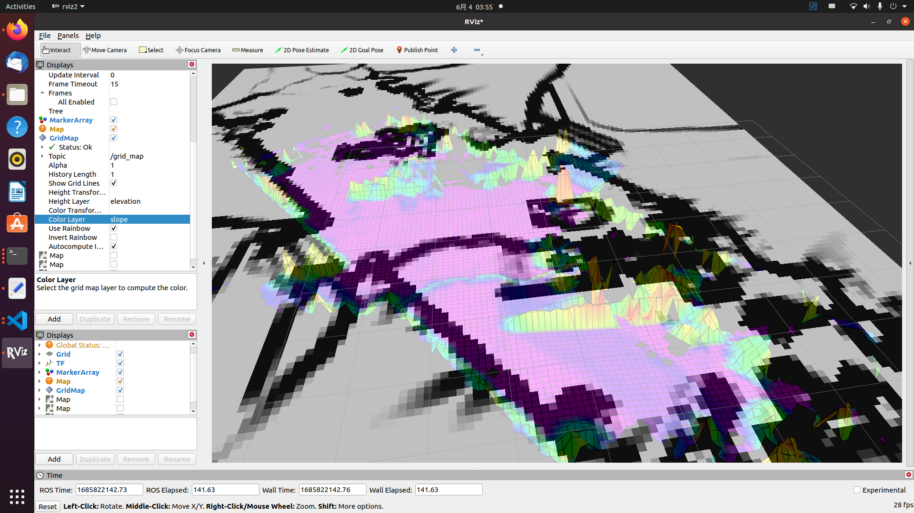
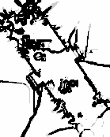

# GripMap生成2.5D高程地图
修改自沈阳航空航天大学TUP战队2023年哨兵导航模块

## 2.5D高程地图与栅格地图
修改``grid_map/grid_map_demos/config/pcd_to_gridmap_demo.yaml``中参数以符合你的需求
```
pcd_to_gridmap:
  ros__parameters:
    #PCD地图路径
    pcd_file_path: "/home/tup/Downloads/LOAM/GlobalMap.pcd"
    #建图frame_id
    map_frame_id: "map"
    #滤波相关参数
    filters:
        ...
```
如果你需要pcd点云如翻转，平移，滤波之类的预处理，你可以修改TUP2023-Sentry-Nav/grid_map/grid_map_demos/config/pcl_grid_config.yaml中的配置以满足你的需求。

完成配置后启动程序
```
source install/setup.bash
ros2 launch grid_map_demos pcd_to_gridmap_demo_launch
```
以下为`height_layer`为`elevation`，`color_layer`为`slope_grid`生成的2.5D高程地图

在该配置下，可自打开rviz，你可以看到`/elevation_grid`, `slope_grid`
Topic下的栅格地图.

使用类似以下命令的以保存地图.
```bash
ros2 run nav2_map_server map_saver_cli -f your_map_name -t /your_map_topic_name
```
以下为使用`slope_grid`生成的2d栅格地图，可使用GIMP稍加修改离群像素，之后便可直接用于nav2导航.


